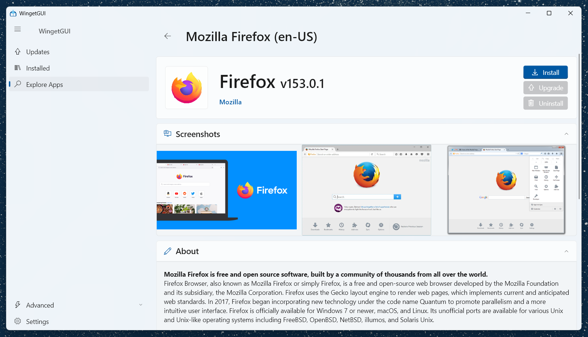
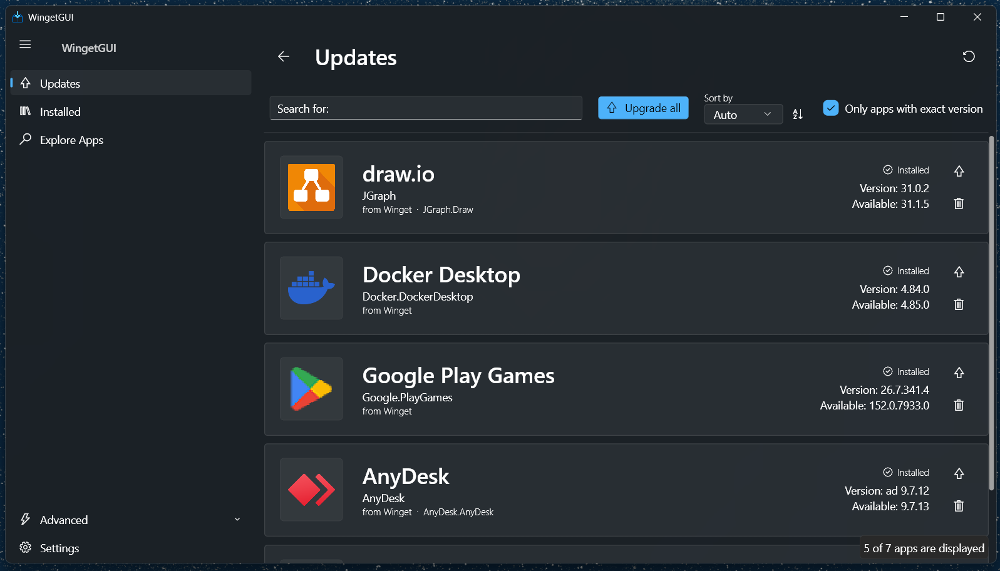

<h1>
  
  WingetGUI
</h1>

WingetGUI is a polished Windows desktop frontend for [Windows Package Manager WinGet](https://learn.microsoft.com/windows/package-manager/winget/).
It brings winget into a Fluent UI app with fast package browsing, rich package details, and a cleaner workflow for everyday install and update tasks.

<div style="display: flex; gap: 12px; flex-wrap: wrap;">
  
  
</div>

## Highlights

- Search packages and inspect results in a desktop-friendly interface
- View installed apps, available updates, publishers, logs, and winget output
- Open detailed package pages with metadata, install options, screenshots, and links
- Run common winget commands without living in the terminal
- Switch between light and dark themes with Windows accent color support
- Use localized UI support, including English and German resources
- Built with Flutter and Fluent UI for a native Windows feel

## Project layout

- `lib/` — app code, navigation, pages, widgets, and winget integration
- `local_packages/` — in-repo packages shared across the app
- `test/` — unit tests for parsing, settings, and data handling
- `assets/` — icons and bundled app assets

## Requirements

- Windows 10/11 with desktop support
- Flutter SDK 3.7 or newer
- Winget installed and available on the machine

## Getting started

```bash
flutter pub get
flutter run -d windows
```

## Building

```bash
flutter build windows
```

## Packaging as MSIX

WingetGUI includes MSIX configuration in `pubspec.yaml`.
To create a signed package:

1. **Create or obtain a code-signing certificate.** \
   For testing purposes, you can create a self-signed certificate (see below).
2. **Set the certificate path and password in `pubspec.yaml`.** \
   See https://pub.dev/packages/msix#-signing-options for reference. Make sure not to commit your certificate password to source control.
3. Run:

```bash
dart run msix:create
```

### Self-signed certificate
To create a self-signed certificate for testing purposes, follow these steps:
1. Create a self-signed certificate and add it to "Local Machine Trusted People".
   See https://learn.microsoft.com/en-us/windows/msix/package/create-certificate-package-signing#use-new-selfsignedcertificate-to-create-a-certificate for reference.
2. Use the path to the .pfx file created in step 1 and the password to the msix config in the pubspec.yaml file.


## Notes

- The app caches package and screenshot data locally for smoother browsing.
- Some advanced pages expose internal database and diagnostic tools for development and troubleshooting.

## License

See [LICENSE.md](LICENSE.md).
